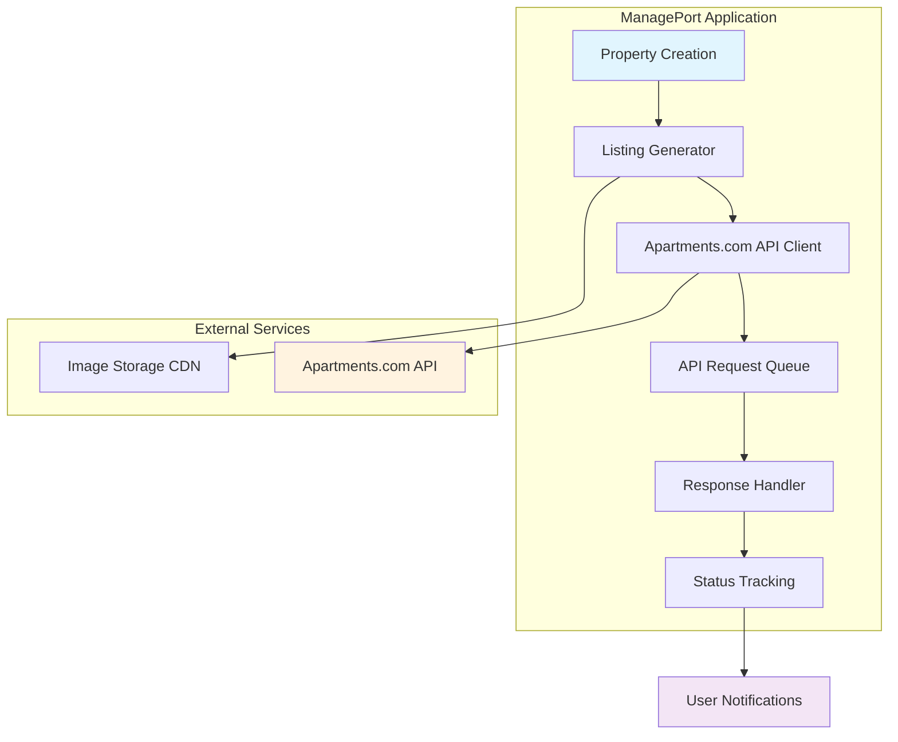
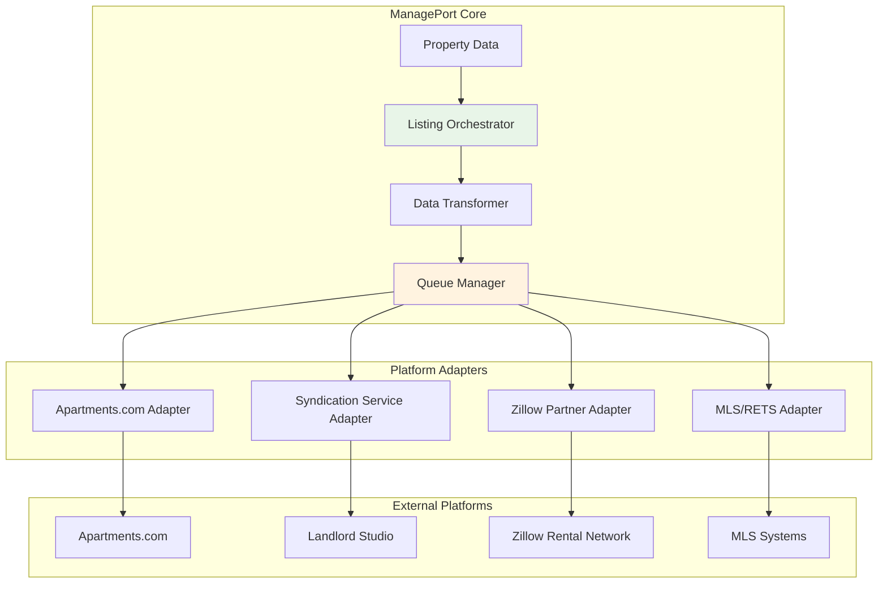
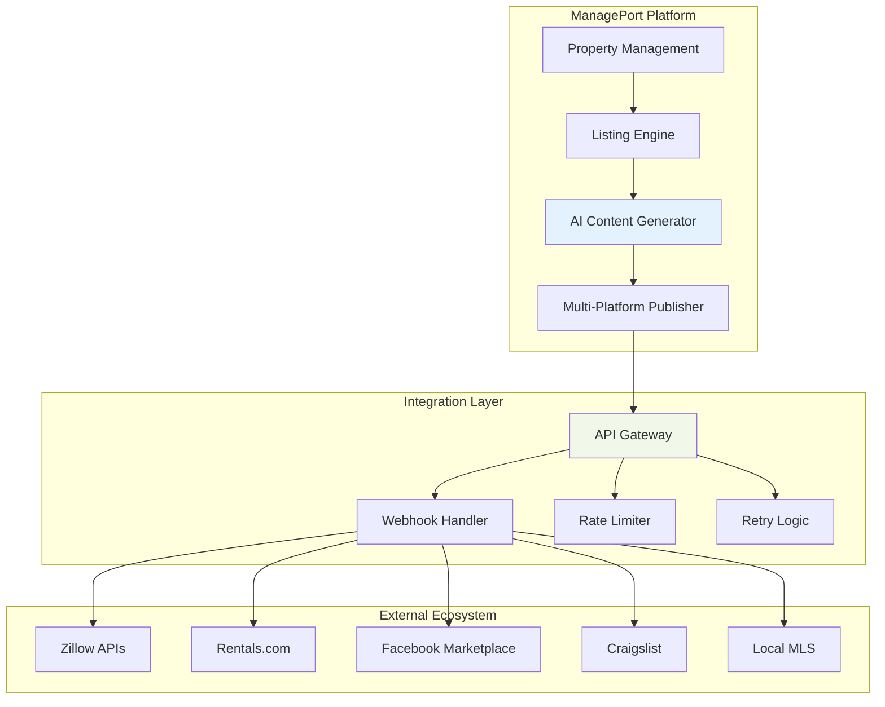
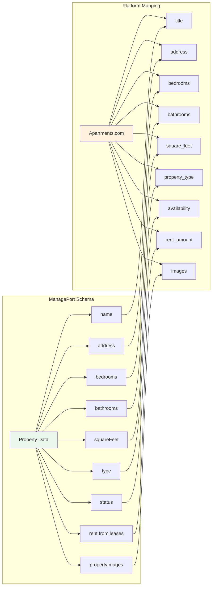
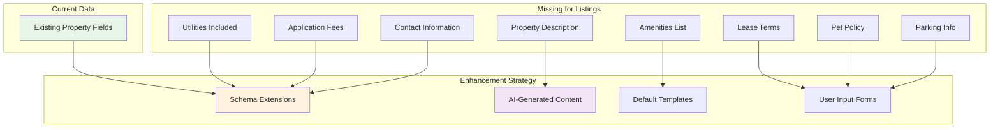
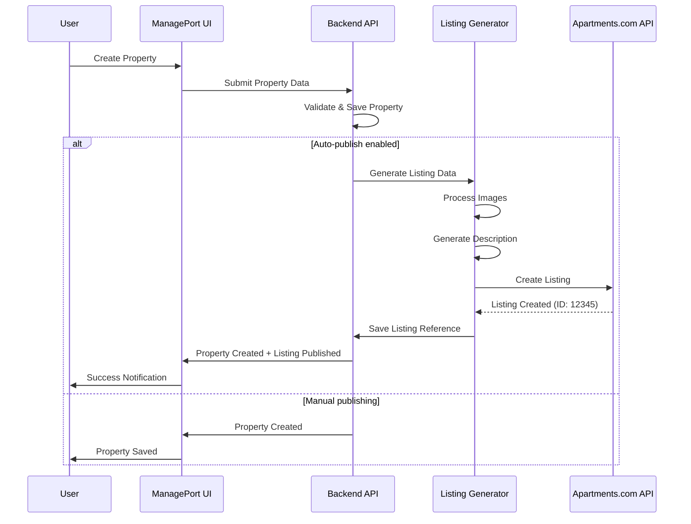
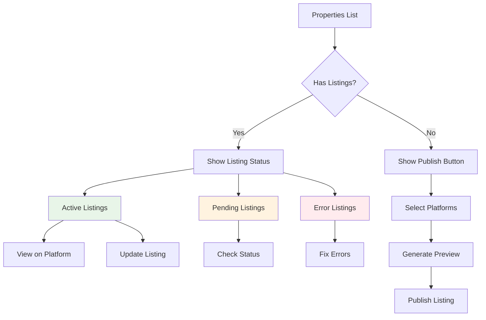
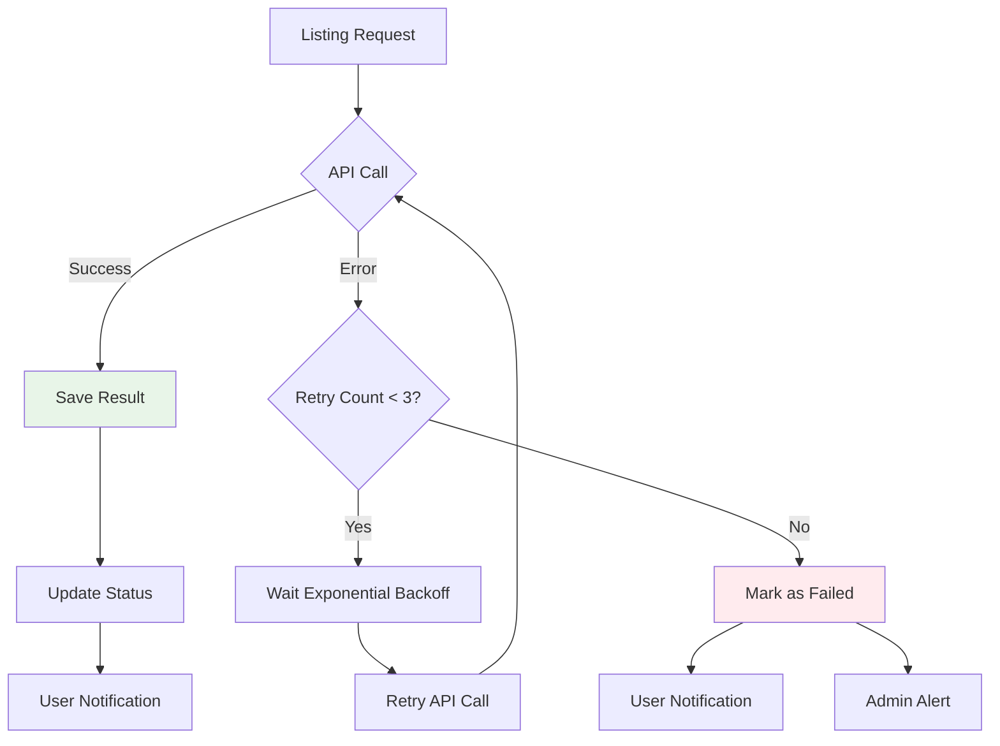

# Real Estate Listing Integration Plan

## Executive Summary

This plan outlines the implementation of automated property listing creation for popular real estate platforms including Zillow, Redfin, and Apartments.com. Based on comprehensive platform research, we prioritize simplicity and immediate value delivery through strategic partnerships and phased implementation.

## Problem Statement

Property managers currently manually create listings across multiple platforms, leading to:
- **Time waste** - 2-3 hours per property across platforms
- **Inconsistent data** - Manual entry errors and variations
- **Delayed marketing** - Properties sit vacant longer
- **Competitive disadvantage** - Slower time-to-market than automated systems

## Solution Architecture

### Phase 1: Immediate Implementation (Apartments.com)



### Phase 2: Multi-Platform Syndication



### Phase 3: Enterprise Integration



## Data Mapping Strategy

### Current ManagePort Data → Platform Requirements



### Required Data Extensions



## Technical Implementation Plan

### Phase 1: Apartments.com Integration (Weeks 1-4)

#### Week 1: Foundation Setup
- **API Client Development**
  - OAuth 2.0 authentication implementation
  - Rate limiting and retry logic
  - Error handling and response parsing
  - Test environment setup

- **Database Extensions**
  ```sql
  -- New table for listing tracking
  CREATE TABLE listing_publications (
    id: v.id("listing_publications"),
    propertyId: v.id("properties"),
    platform: v.string(), // "apartments.com", "zillow", etc.
    externalListingId: v.string(),
    status: v.union("pending", "active", "error", "expired"),
    lastSyncAt: v.string(),
    errorMessage: v.optional(v.string()),
    createdAt: v.string()
  );
  
  -- Extended property data for listings
  ALTER TABLE properties ADD (
    description: v.optional(v.string()),
    amenities: v.optional(v.array(v.string())),
    petPolicy: v.optional(v.string()),
    parkingSpaces: v.optional(v.number()),
    applicationFee: v.optional(v.number()),
    leaseTerms: v.optional(v.string())
  );
  ```

#### Week 2: Core Listing Engine
- **Listing Generator Service**
  ```typescript
  class ListingGenerator {
    async createListing(propertyId: string): Promise<ListingData> {
      const property = await this.getProperty(propertyId);
      const images = await this.getPropertyImages(propertyId);
      const activeLeases = await this.getActiveLeases(propertyId);
      
      return {
        title: property.name,
        address: property.address,
        rent: this.calculateRent(activeLeases),
        images: await this.processImages(images),
        description: await this.generateDescription(property),
        // ... additional mappings
      };
    }
  }
  ```

- **Image Processing Pipeline**
  - Image resizing and optimization
  - Platform-specific image requirements
  - CDN integration for external hosting

#### Week 3: User Interface
- **Property Form Enhancements**
  - Listing-specific fields (description, amenities)
  - Checkbox for "Auto-publish to platforms"
  - Listing preview modal

- **Listing Management Dashboard**
  - View published listings
  - Sync status indicators
  - Manual refresh capabilities
  - Error resolution interface

#### Week 4: Testing & Deployment
- **Integration Testing**
  - End-to-end listing creation flow
  - API error handling scenarios
  - Image upload and processing
  - Data validation and formatting

- **User Acceptance Testing**
  - Real property listing creation
  - Platform verification
  - Performance testing
  - Error recovery testing

### Phase 2: Multi-Platform Expansion (Weeks 5-8)

#### Week 5: Syndication Service Integration
- **Landlord Studio/Rentec Direct Partnership**
  - API integration for multi-platform syndication
  - Single integration reaching 5+ platforms
  - Cost-benefit analysis and implementation

- **Platform Adapter Pattern**
  ```typescript
  interface PlatformAdapter {
    createListing(data: ListingData): Promise<ListingResult>;
    updateListing(id: string, data: ListingData): Promise<ListingResult>;
    deleteListing(id: string): Promise<void>;
    getListingStatus(id: string): Promise<ListingStatus>;
  }
  
  class ApartmentsComAdapter implements PlatformAdapter {
    // Apartments.com specific implementation
  }
  
  class SyndicationAdapter implements PlatformAdapter {
    // Syndication service implementation
  }
  ```

#### Week 6: Queue Management System
- **Background Job Processing**
  - **Listing creation queue** - Processing property listing submissions to external platforms
  - **Retry mechanisms** for failed API calls with exponential backoff
  - **Rate limiting compliance** - Managing API request quotas across platforms
  - **Status tracking and notifications** - Monitoring listing publication status
  - **Image processing pipeline** - Optimizing and uploading property images
  - **Batch operations** - Publishing multiple properties simultaneously
  - **Automated error notifications** and recovery processes

- **Webhook Integration**
  - **Webhook processing** - Handling status updates from external platforms
  - Listen for listing status updates
  - Automated error notifications
  - Performance monitoring

- **Technical Implementation**
  - Uses **Convex crons** for job scheduling
  - Implements **queue management and prioritization** 
  - Provides **job status tracking and monitoring**
  - Handles **platform-specific rate limiting**

#### Week 7: Advanced Features
- **AI-Powered Content Generation**
  - Auto-generate property descriptions
  - Suggest amenities based on property type
  - Optimize titles for search engines
  - Market-specific language adaptation

- **Bulk Operations**
  - Publish multiple properties at once
  - Batch status updates
  - Portfolio-wide listing management

#### Week 8: Zillow Partnership Application
- **Partnership Application Process**
  - Technical requirements documentation
  - Integration architecture proposal
  - Security and compliance review
  - Timeline and implementation plan

### Phase 3: Enterprise Features (Weeks 9-12)

#### Week 9: MLS Integration
- **RETS/MLS Connection**
  - Real estate data standard implementation
  - MLS membership requirements
  - Data feed integration
  - Compliance with MLS rules

#### Week 10: Advanced Analytics
- **Listing Performance Tracking**
  - View counts and engagement metrics
  - Platform-specific performance
  - Optimization recommendations
  - Market trend analysis

#### Week 11: Mobile Optimization
- **Mobile-First Design**
  - Responsive listing creation forms
  - Mobile image upload and editing
  - Push notifications for listing status
  - Quick listing updates

#### Week 12: Launch & Optimization
- **Production Deployment**
  - Full platform launch
  - Performance monitoring
  - User feedback collection
  - Continuous optimization

## Data Schema Extensions

### Listing Publications Table
```typescript
listingPublications: defineTable({
  propertyId: v.id("properties"),
  platform: v.string(), // "apartments.com", "zillow", "landlord_studio"
  externalListingId: v.string(), // Platform's listing ID
  status: v.union(
    v.literal("pending"),
    v.literal("active"),
    v.literal("error"),
    v.literal("expired"),
    v.literal("draft")
  ),
  publishedAt: v.optional(v.string()),
  lastSyncAt: v.optional(v.string()),
  errorMessage: v.optional(v.string()),
  syncFrequency: v.optional(v.string()), // "daily", "weekly", "manual"
  autoRenew: v.optional(v.boolean()),
  createdAt: v.string(),
  updatedAt: v.optional(v.string()),
})
```

### Extended Property Schema
```typescript
properties: defineTable({
  // ... existing fields ...
  
  // Listing-specific fields
  description: v.optional(v.string()),
  amenities: v.optional(v.array(v.string())),
  petPolicy: v.optional(v.string()),
  parkingSpaces: v.optional(v.number()),
  applicationFee: v.optional(v.number()),
  securityDepositRequired: v.optional(v.number()),
  leaseTerms: v.optional(v.string()),
  availableDate: v.optional(v.string()),
  
  // Marketing fields
  marketingTitle: v.optional(v.string()),
  keywordTags: v.optional(v.array(v.string())),
  tourAvailable: v.optional(v.boolean()),
  virtualTourUrl: v.optional(v.string()),
  
  // Listing automation settings
  autoPublish: v.optional(v.boolean()),
  publishToPlatforms: v.optional(v.array(v.string())),
  listingPreferences: v.optional(v.object({
    includePricing: v.boolean(),
    includeContactInfo: v.boolean(),
    autoRenewListings: v.boolean(),
  })),
})
```

## User Experience Flow

### Property Creation with Auto-Listing



### Listing Management Dashboard



## API Integration Details

### Apartments.com API Implementation

```typescript
class ApartmentsComClient {
  private readonly baseUrl = 'https://api.apartments.com/v1';
  private readonly authToken: string;
  
  async createListing(data: ListingData): Promise<ListingResult> {
    const payload = {
      title: data.title,
      address: {
        street: data.address,
        city: data.city,
        state: data.state,
        zip: data.zip
      },
      rent: {
        min: data.rent,
        max: data.rent
      },
      bedrooms: data.bedrooms,
      bathrooms: data.bathrooms,
      square_feet: data.squareFeet,
      description: data.description,
      amenities: data.amenities,
      images: data.images.map(img => ({
        url: img.url,
        caption: img.description
      })),
      contact: {
        name: data.contactName,
        phone: data.contactPhone,
        email: data.contactEmail
      },
      lease_terms: data.leaseTerms,
      available_date: data.availableDate,
      pet_policy: data.petPolicy
    };
    
    const response = await fetch(`${this.baseUrl}/listings`, {
      method: 'POST',
      headers: {
        'Authorization': `Bearer ${this.authToken}`,
        'Content-Type': 'application/json'
      },
      body: JSON.stringify(payload)
    });
    
    if (!response.ok) {
      throw new Error(`API Error: ${response.status} - ${await response.text()}`);
    }
    
    return await response.json();
  }
}
```

### Syndication Service Integration

```typescript
class SyndicationServiceClient {
  async publishToMultiplePlatforms(
    data: ListingData,
    platforms: string[]
  ): Promise<SyndicationResult> {
    const payload = {
      property: this.transformListingData(data),
      platforms: platforms,
      sync_frequency: 'daily',
      auto_renew: true
    };
    
    const response = await fetch('https://api.landlordstudio.com/v1/syndicate', {
      method: 'POST',
      headers: {
        'Authorization': `Bearer ${this.apiKey}`,
        'Content-Type': 'application/json'
      },
      body: JSON.stringify(payload)
    });
    
    return await response.json();
  }
}
```

## Error Handling & Resilience

### Retry Strategy



### Error Recovery Processes

1. **Authentication Failures**
   - Auto-refresh OAuth tokens
   - Fallback to manual re-authentication
   - User notification for action required

2. **Rate Limiting**
   - Exponential backoff implementation
   - Queue management for delayed requests
   - Priority system for urgent listings

3. **Data Validation Errors**
   - Field-level error reporting
   - Suggested corrections
   - Partial save capabilities

4. **Network Failures**
   - Offline queue management
   - Automatic retry on reconnection
   - Status preservation across failures

## Security Considerations

### API Key Management
- Secure key storage in environment variables
- Key rotation procedures
- Separate keys for development/production

### Data Privacy
- PII handling compliance
- Tenant data protection
- Image rights and permissions

### Platform Compliance
- Terms of service adherence
- Rate limiting respect
- Data usage policies

## Performance Optimization

### Image Processing
- Lazy loading for large galleries
- Automatic image compression
- CDN integration for fast delivery
- Progressive JPEG/WebP format support

### API Efficiency
- Batch operations where possible
- Caching for frequently accessed data
- Connection pooling
- Request deduplication

### Database Optimization
- Indexing on frequently queried fields
- Pagination for large result sets
- Efficient joins for related data
- Regular performance monitoring

## Monitoring & Analytics

### Key Performance Indicators (KPIs)
- Listing creation success rate
- Time to publish metrics
- User engagement with listings
- Platform-specific performance

### Monitoring Dashboard
- Real-time listing status
- API response times
- Error rates by platform
- User activity metrics

### Alerting System
- Failed listing notifications
- API outage detection
- Performance degradation alerts
- User error notifications

## Cost Analysis

### Development Costs
- **Phase 1**: $15,000 - $20,000 (4 weeks)
- **Phase 2**: $20,000 - $25,000 (4 weeks)
- **Phase 3**: $25,000 - $30,000 (4 weeks)
- **Total Estimated**: $60,000 - $75,000

### Operational Costs
- **API Usage**: $50 - $200/month (based on volume)
- **Syndication Services**: $100 - $500/month
- **Image Storage/CDN**: $25 - $100/month
- **Hosting/Infrastructure**: $50 - $200/month

### ROI Calculation
- **Time Savings**: 2-3 hours per property × $30/hour = $60-90 per property
- **Vacancy Reduction**: 3-5 days faster listing = $100-300 per property
- **Break-even**: ~50 properties published per month

## Risk Assessment

### High-Risk Items
1. **Platform API Changes** - Mitigation: Adapter pattern, comprehensive testing
2. **Rate Limiting** - Mitigation: Queue management, multiple API keys
3. **Data Compliance** - Mitigation: Legal review, privacy controls
4. **Partnership Approval Delays** - Mitigation: Backup syndication services

### Medium-Risk Items
1. **Image Processing Performance** - Mitigation: CDN, compression
2. **User Adoption** - Mitigation: Phased rollout, training materials
3. **Integration Complexity** - Mitigation: Modular architecture, testing

### Low-Risk Items
1. **Technical Implementation** - Well-understood patterns
2. **UI/UX Changes** - Iterative improvement approach
3. **Database Changes** - Backward-compatible design

## Success Metrics

### Technical Metrics
- **99.5% API uptime**
- **<5 second listing creation time**
- **95% successful publication rate**
- **<1% error rate**

### User Metrics
- **80% adoption rate** within 6 months
- **50% reduction in manual listing time**
- **90% user satisfaction score**
- **Increase in listing quantity by 200%**

### Business Metrics
- **Reduce vacancy time by 3-5 days**
- **Increase rental income by 5-10%**
- **Improve property manager efficiency by 40%**
- **Expand market reach by 300%**

## Future Enhancements

### Advanced AI Features
- **Smart Pricing Suggestions** - Market analysis and pricing recommendations
- **Content Optimization** - A/B testing for descriptions and titles
- **Image Enhancement** - Automatic image improvement and staging
- **Market Intelligence** - Competitive analysis and positioning

### Advanced Integrations
- **Social Media Publishing** - Facebook, Instagram, Twitter
- **Email Marketing** - Automated prospect nurturing
- **CRM Integration** - Lead management and follow-up
- **Accounting Software** - Financial tracking and reporting

### Mobile Applications
- **Dedicated Mobile App** - On-the-go listing management
- **Push Notifications** - Real-time status updates
- **Mobile Photography** - Built-in camera with optimization
- **Quick Actions** - Rapid listing updates and responses

## Conclusion

This comprehensive plan provides a pragmatic approach to real estate listing integration, prioritizing immediate value delivery through Apartments.com while building toward a robust multi-platform system. The phased implementation ensures manageable development cycles while maintaining system stability and user satisfaction.

The architecture emphasizes simplicity and maintainability, following senior engineering principles of modularity, error resilience, and performance optimization. By focusing on proven integration patterns and strategic partnerships, we minimize risk while maximizing long-term value for property managers.

The estimated 12-week timeline provides a realistic path to full implementation, with early wins in Phase 1 building momentum for more complex features in subsequent phases. Regular monitoring and user feedback loops ensure the system evolves to meet real-world needs effectively.