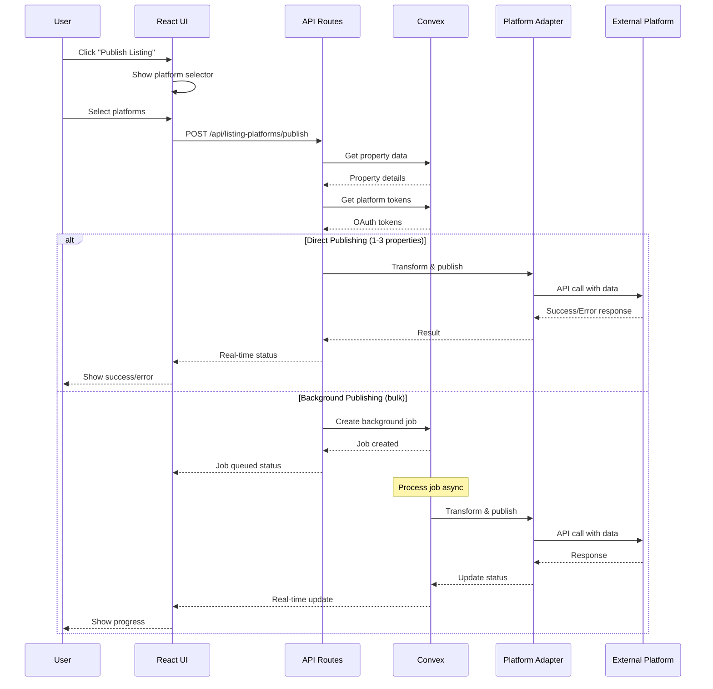
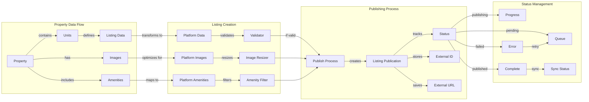
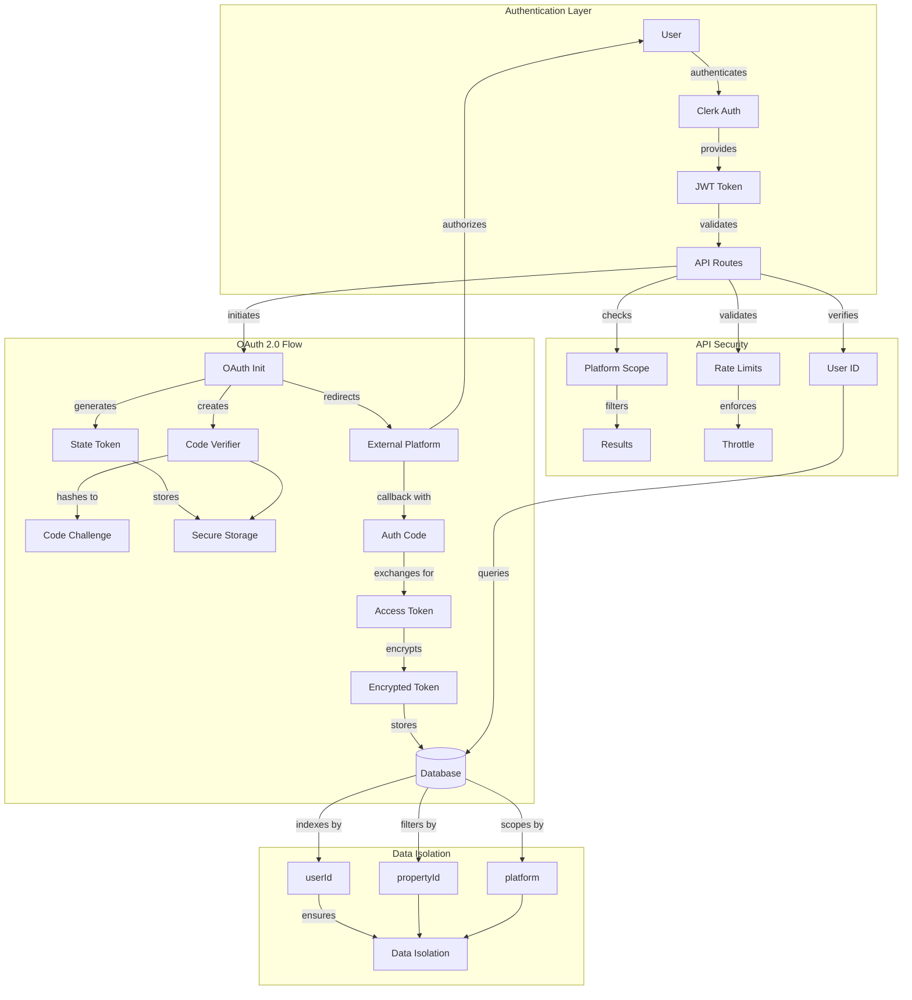
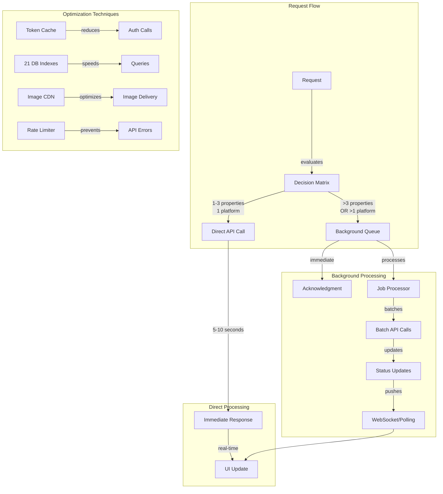
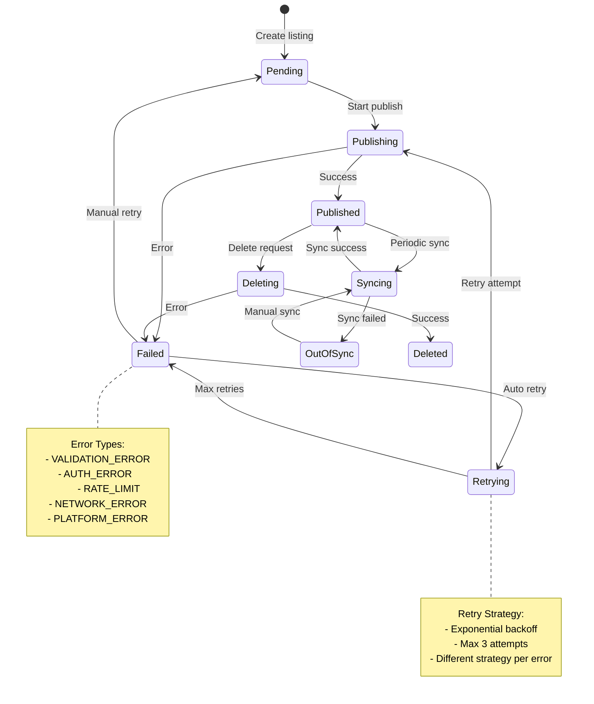
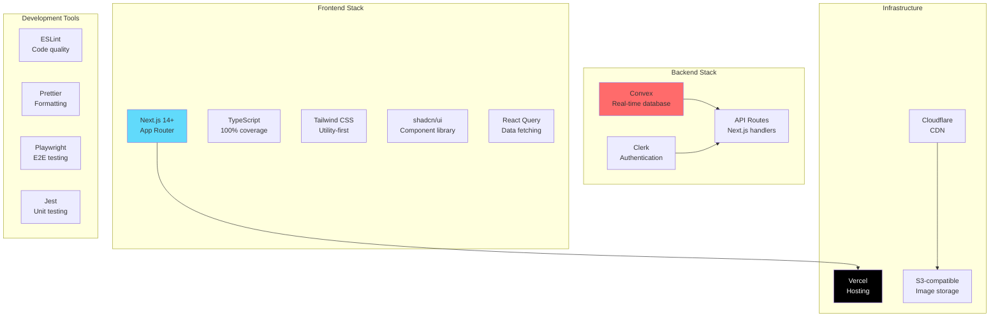
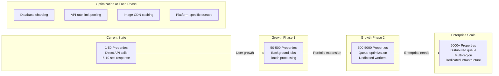

# Listing Integration Architecture Diagram

## System Architecture Overview

```mermaid
graph TB
    subgraph "User Interface Layer"
        UI[User Interface]
        UI --> LP[Listings Page<br/>Main navigation entry]
        UI --> LM[Listing Manager<br/>Publishing interface]
        UI --> LD[Listings Dashboard<br/>Portfolio overview]
        UI --> PC[Platform Connections<br/>OAuth setup]
    end

    subgraph "Frontend Components"
        LP --> |manages| LM
        LP --> |displays| LD
        LP --> |configures| PC
        
        LM --> |publishes to| PS[Platform Selector]
        LM --> |tracks| PP[Publishing Progress]
        LM --> |shows| ER[Error Recovery]
    end

    subgraph "API Routes Layer"
        AR[API Routes<br/>/api/listing-platforms/]
        AR --> OA[OAuth Routes<br/>/oauth/[platform]/authorize<br/>/oauth/[platform]/callback]
        AR --> PA[Publishing Routes<br/>/publish<br/>/update<br/>/delete]
        AR --> SA[Status Routes<br/>/status<br/>/sync]
    end

    subgraph "Business Logic Layer"
        AC[API Client<br/>Retry logic<br/>Rate limiting]
        PR[Platform Registry<br/>Adapter management]
        OH[OAuth Handler<br/>PKCE flow<br/>Token management]
        
        PA --> AC
        AC --> PR
        OA --> OH
    end

    subgraph "Platform Adapters"
        PR --> AA[Apartments.com Adapter<br/>- OAuth 2.0<br/>- 20 images max<br/>- 30 req/min]
        PR --> RA[Rentspree Adapter<br/>- 30+ platforms<br/>- Bulk syndication<br/>- API key auth]
        PR --> ZA[Zillow Adapter<br/>- Premium listings<br/>- OAuth 2.0<br/>- 60 req/min]
        
        AA --> |transforms| DT1[Data Transformer]
        RA --> |transforms| DT2[Data Transformer]
        ZA --> |transforms| DT3[Data Transformer]
    end

    subgraph "Convex Backend"
        CV[Convex Functions]
        CV --> LP2[listingPublications.ts<br/>CRUD operations]
        CV --> PT[platformTokens.ts<br/>OAuth tokens]
        CV --> BJ[backgroundJobs.ts<br/>Bulk operations]
        CV --> CR[crons.ts<br/>Token refresh<br/>Status sync]
    end

    subgraph "Database Schema"
        DB[(Convex Database)]
        DB --> LPT[listingPublications<br/>84 fields<br/>21 indexes]
        DB --> PTT[platformTokens<br/>OAuth data<br/>Encryption]
        DB --> PR2[properties<br/>Source data]
    end

    subgraph "External Platforms"
        APT[Apartments.com API<br/>$49.99/month]
        RSP[Rentspree API<br/>Free tier available]
        ZIL[Zillow API<br/>Premium required]
    end

    %% Connections
    UI --> AR
    AR --> CV
    CV --> DB
    
    AA --> APT
    RA --> RSP
    ZA --> ZIL
    
    OH --> PT
    LP2 --> LPT
    PT --> PTT
    
    style UI fill:#e1f5fe
    style DB fill:#fff3e0
    style APT fill:#ffebee
    style RSP fill:#ffebee
    style ZIL fill:#ffebee
```

## Data Flow Diagram



## Component Interaction Diagram



## Security Architecture



## Performance Optimization Strategy



## Error Handling & Recovery



## Technology Stack



## Scaling Strategy



---

This architecture demonstrates a **production-ready, scalable system** that can grow from individual landlords to enterprise property management companies without significant re-architecture.